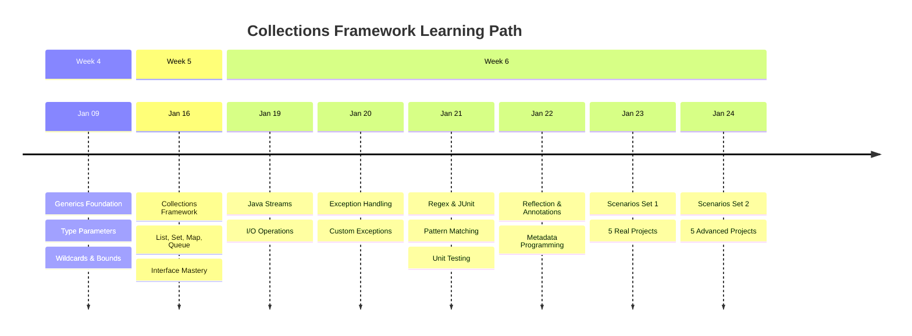
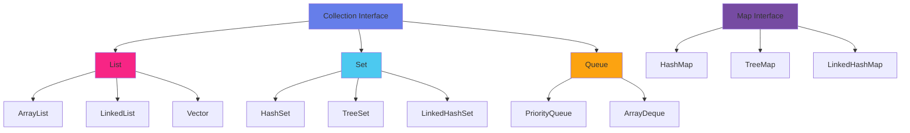

<div align="center">

<!-- Epic Header with Gradient -->


<br/>


<!-- Premium Badges -->


<!-- Navigation -->
<p align="center">
  <a href="#-what-awaits-you">🎯 Overview</a> •
  <a href="#-the-journey">📖 Journey</a> •
  <a href="#-project-arsenal">🗂️ Structure</a> •
  <a href="#-mastered-concepts">💎 Concepts</a> •
  <a href="#-get-started">⚡ Quick Start</a>
</p>

<!-- Repository Links -->
<p align="center">
  <a href="https://github.com/rudresh-sharma/BridgeLabz-Training/tree/java-collections-practice">
    
  </a>
  <a href="https://github.com/rudresh-sharma/BridgeLabz-Training/issues">
    
  </a>
</p>

<br/>

<!-- Divider -->


</div>

<br/><br/>

## 🎯 Overview

This repository documents a comprehensive journey through Java's Collections Framework, covering everything from **Generics** to **Reflection**, from **Streams** to **Real-World Applications**.

**Training Program:** BridgeLabz Fellowship  
**Duration:** 3 Weeks (January 9 - 24, 2026)  
**Focus:** Production-ready implementations with industry best practices

### What's Covered

- Generic Programming & Type Safety
- Collections Framework (List, Set, Map, Queue)
- Stream API & Functional Programming
- Exception Handling Strategies
- Regex Pattern Matching
- JUnit Testing & TDD
- Reflection & Custom Annotations
- 10 Real-World Industry Projects

<br/>

<!-- Visual Separator -->
<p align="center">
  
</p>

<br/>

## 📁 Project Structure

```
🌳 java-collections-practice/
│
├── 📦 gcr-codebase/
│   └── JavaCollectionsPractice/
│       └── src/com/
│           │
│           ├── 🎨 generics/                    → Type-Safe Programming
│           └── 🎁 collections/
│               │
│               ├── 📋 listinterface/           → ArrayList, LinkedList, Vector
│               ├── 🎲 setinterface/            → HashSet, TreeSet, LinkedHashSet
│               ├── 🗺️ mapinterface/             → HashMap, TreeMap, LinkedHashMap
│               ├── 🔄 queueinterface/          → PriorityQueue, Deque, ArrayDeque
│               ├── 🌊 streams/                 → File I/O, Object Streams
│               ├── 🔤 regex/                   → Pattern Matching
│               ├── ✅ junit/                   → Unit Testing
│               ├── 🔍 reflections/             → Runtime Analysis
│               └── 📝 annotations/             → Custom Annotations
│
└── 💼 scenario-based/
    └── JavaCollectionsScenario/src/com/
        │
        ├── 📅 day1/   
        └── 📅 day2/                 

```

<br/>

<!-- Visual Separator -->
<p align="center">
  
</p>

<br/>

## 📖 Learning Journey

### Timeline Overview



</div>

<br/>

---

### Week 4: Generics Foundation

<table>
<tr>
<td width="20%" align="center">

**📅 DAY 5**  
*Jan 9, 2026*

</td>
<td width="80%">

<details open>
<summary><b>🎯 Generics Mastery</b></summary>

<br/>

<table>
<tr>
<td width="50%">

**📚 Topics Covered**

- Type Parameters (`<T>`, `<K,V>`)
- Generic Classes & Methods
- Bounded Type Parameters
  - Upper Bounds (`<T extends Number>`)
  - Lower Bounds (`<T super Integer>`)
- Wildcards (`?`, `? extends`, `? super`)
- Type Erasure & Runtime Behavior

</td>
<td width="50%">

**💡 Key Learnings**

```java
// Generic Method Example
public <T extends Comparable<T>> 
T findMax(List<T> list) {
    return Collections.max(list);
}

// Wildcard Usage
public void process(
    List<? extends Number> nums
) {
    // Process any number type
}
```

</td>
</tr>
</table>

**🔗 [View Complete Implementation →](https://github.com/rudresh-sharma/BridgeLabz-Training/tree/java-collections-practice/java-collections-practice/gcr-codebase/JavaCollectionsPractice/src/com/generics)**

</details>

</td>
</tr>
</table>

<br/>

---

### Week 5: Collections Framework

<table>
<tr>
<td width="20%" align="center">

**📅 DAY 5**  
*Jan 16, 2026*

</td>
<td width="80%">

<details open>
<summary><b>🗂️ Complete Collections Ecosystem</b></summary>

<br/>

<!-- Collections Hierarchy Visualization -->
<div align="center">



</div>

<br/>

<table>
<tr>
<th width="25%">📋 List</th>
<th width="25%">🎲 Set</th>
<th width="25%">🗺️ Map</th>
<th width="25%">🔄 Queue</th>
</tr>
<tr>
<td valign="top">

**Implementations:**
- ArrayList
- LinkedList
- Vector
- Stack

**Use Cases:**
- Ordered data
- Duplicates allowed
- Index-based access

**[📂 Code](https://github.com/rudresh-sharma/BridgeLabz-Training/tree/java-collections-practice/java-collections-practice/gcr-codebase/JavaCollectionsPractice/src/com/collections/listinterface)**

</td>
<td valign="top">

**Implementations:**
- HashSet
- TreeSet
- LinkedHashSet

**Use Cases:**
- Unique elements
- Fast lookup
- No duplicates

**[📂 Code](https://github.com/rudresh-sharma/BridgeLabz-Training/tree/java-collections-practice/java-collections-practice/gcr-codebase/JavaCollectionsPractice/src/com/collections/setinterface)**

</td>
<td valign="top">

**Implementations:**
- HashMap
- TreeMap
- LinkedHashMap
- Hashtable

**Use Cases:**
- Key-value pairs
- Fast retrieval
- Caching

**[📂 Code](https://github.com/rudresh-sharma/BridgeLabz-Training/tree/java-collections-practice/java-collections-practice/gcr-codebase/JavaCollectionsPractice/src/com/collections/mapinterface)**

</td>
<td valign="top">

**Implementations:**
- PriorityQueue
- ArrayDeque
- LinkedList

**Use Cases:**
- FIFO operations
- Task scheduling
- BFS traversal

**[📂 Code](https://github.com/rudresh-sharma/BridgeLabz-Training/tree/java-collections-practice/java-collections-practice/gcr-codebase/JavaCollectionsPractice/src/com/collections/queueinterface)**

</td>
</tr>
</table>

</details>

</td>
</tr>
</table>

<br/>

---

### Week 6: Advanced Java Concepts

<!-- Day-wise breakdown in card format -->
<table>
<tr>
<td width="50%" valign="top">

#### Day 1: Java Streams  
*January 19, 2026*

<details>
<summary>I/O Stream Operations</summary>

<br/>

**Stream Types:**
- 📄 File Streams
- 🎁 Object Streams
- 📦 ByteArray Streams
- ⚡ Buffered Streams
- 📖 Reader & Writer

**Practical Skills:**
- File handling
- Serialization
- Data persistence
- Performance optimization

**[📂 View Implementation](https://github.com/rudresh-sharma/BridgeLabz-Training/tree/java-collections-practice/java-collections-practice/gcr-codebase/JavaCollectionsPractice/src/com/collections/streams)**

</details>

---

#### Day 3: Regex & Testing  
*January 21, 2026*

<details>
<summary>Pattern Matching & Quality Assurance</summary>

<br/>

**Regex Patterns:**
- 📧 Email Validation
- 🔐 Password Strength
- 📱 Phone Formatting
- 🔍 Text Extraction

**JUnit Framework:**
- ✅ Annotations
- 🧪 Test Cases
- 📊 Assertions
- 🎯 Test Suites

**[📂 Regex Code](https://github.com/rudresh-sharma/BridgeLabz-Training/tree/java-collections-practice/java-collections-practice/gcr-codebase/JavaCollectionsPractice/src/com/collections/regex)** | **[📂 JUnit Code](https://github.com/rudresh-sharma/BridgeLabz-Training/tree/java-collections-practice/java-collections-practice/gcr-codebase/JavaCollectionsPractice/src/com/collections/junit)**

</details>

</td>
<td width="50%" valign="top">

#### Day 2: Exception Handling  
*January 20, 2026*

<details>
<summary>Robust Error Management</summary>

<br/>

**Exception Types:**
- ✅ Checked Exceptions
- ❌ Unchecked Exceptions
- 🎨 Custom Exceptions

**Handling Strategies:**
- try-catch blocks
- try-catch-finally
- try-with-resources
- Exception chaining

**[📂 View Implementation](https://github.com/rudresh-sharma/BridgeLabz-Training/tree/java-collections-practice/java-collections-practice/gcr-codebase/JavaCollectionsPractice/src/com/collections/exceptionhandling)**

</details>

---

#### Day 4: Reflection & Annotations  
*January 22, 2026*

<details>
<summary>Metadata Programming</summary>

<br/>

**Reflection API:**
- Class inspection
- Dynamic invocation
- Runtime analysis

**Annotations:**
- Built-in annotations
- Custom annotations
- Annotation processing
- Real-world use cases

**[📂 Reflection Code](https://github.com/rudresh-sharma/BridgeLabz-Training/tree/java-collections-practice/java-collections-practice/gcr-codebase/JavaCollectionsPractice/src/com/collections/reflections)** | **[📂 Annotations Code](https://github.com/rudresh-sharma/BridgeLabz-Training/tree/java-collections-practice/java-collections-practice/gcr-codebase/JavaCollectionsPractice/src/com/collections/annotations)**

</details>

</td>
</tr>
</table>

<br/>

---

### Real-World Scenario Projects

<!-- Scenarios in Modern Card Design -->
<table>
<tr>
<td width="50%" valign="top">

### Day 5: Scenarios Set 1  
*January 23, 2026*

<br/>

<table>
<tr>
<th width="10%">🏆</th>
<th width="50%">Project</th>
<th width="40%">Tech Stack</th>
</tr>
<tr>
<td align="center">1</td>
<td><b>🔍 ResumeAnalyzer</b><br/><sub>Smart HR Filtering System</sub></td>
<td><code>I/O</code> <code>Regex</code> <code>Map</code></td>
</tr>
<tr>
<td align="center">2</td>
<td><b>✈️ TravelLog</b><br/><sub>Trip Organizer App</sub></td>
<td><code>Serialization</code> <code>Set</code> <code>Map</code></td>
</tr>
<tr>
<td align="center">3</td>
<td><b>📊 FeedbackGuru</b><br/><sub>Survey Analysis Tool</sub></td>
<td><code>Regex</code> <code>Generics</code> <code>Map</code></td>
</tr>
<tr>
<td align="center">4</td>
<td><b>🛠️ CodeRepoCleaner</b><br/><sub>Java File Organizer</sub></td>
<td><code>I/O</code> <code>Regex</code> <code>Streams</code></td>
</tr>
<tr>
<td align="center">5</td>
<td><b>📝 ExamScanner</b><br/><sub>Answer Sheet Validator</sub></td>
<td><code>CSV</code> <code>Generics</code> <code>Queue</code></td>
</tr>
</table>

**[🔗 View All Day 1 Projects](https://github.com/rudresh-sharma/BridgeLabz-Training/tree/java-collections-practice/java-collections-practice/scenario-based/JavaCollectionsScenario/src/com/day1)**

</td>
<td width="50%" valign="top">

### Day 6: Scenarios Set 2  
*January 24, 2026*

<br/>

<table>
<tr>
<th width="10%">🏆</th>
<th width="50%">Project</th>
<th width="40%">Tech Stack</th>
</tr>
<tr>
<td align="center">1</td>
<td><b>🏥 MedInventory</b><br/><sub>Hospital Inventory Tracker</sub></td>
<td><code>CSV</code> <code>Regex</code> <code>Exceptions</code></td>
</tr>
<tr>
<td align="center">2</td>
<td><b>💬 ChatLogParser</b><br/><sub>Message Analytics Engine</sub></td>
<td><code>Regex</code> <code>TreeMap</code> <code>Generics</code></td>
</tr>
<tr>
<td align="center">3</td>
<td><b>🎵 SongVault</b><br/><sub>Music Library Manager</sub></td>
<td><code>I/O</code> <code>Streams</code> <code>Set</code></td>
</tr>
<tr>
<td align="center">4</td>
<td><b>🎓 ExamResultUploader</b><br/><sub>Bulk Marks Processor</sub></td>
<td><code>CSV</code> <code>Map</code> <code>PriorityQueue</code></td>
</tr>
<tr>
<td align="center">5</td>
<td><b>🛒 DealTracker</b><br/><sub>E-Commerce Validator</sub></td>
<td><code>Regex</code> <code>Set</code> <code>Comparator</code></td>
</tr>
</table>

**[🔗 View All Day 2 Projects](https://github.com/rudresh-sharma/BridgeLabz-Training/tree/java-collections-practice/java-collections-practice/scenario-based/JavaCollectionsScenario/src/com/day2)**

</td>
</tr>
</table>

<br/>

<!-- Visual Separator -->
<p align="center">
  
</p>

<br/>

## 💎 Key Concepts Mastered

<table>
<tr>
<td width="33%" align="center" valign="top">

### Core Java

<br/>

```
▸ Generic Programming
▸ Type Safety
▸ Parameterized Types
▸ Bounded Types
▸ Wildcards
▸ Type Erasure
▸ Lambda Expressions
▸ Method References
```

</td>
<td width="33%" align="center" valign="top">

### Collections Framework

<br/>

```
▸ List Interface
▸ Set Interface
▸ Map Interface
▸ Queue Interface
▸ Sorting & Searching
▸ Comparators
▸ Collections Utils
▸ Concurrent Collections
```

</td>
<td width="33%" align="center" valign="top">

### Advanced Topics

<br/>

```
▸ Stream API
▸ Exception Handling
▸ Regex Patterns
▸ JUnit Testing
▸ Reflection API
▸ Custom Annotations
▸ Serialization
▸ File I/O
```

</td>
</tr>
</table>

<br/>

## ⚡ Getting Started

### Prerequisites

<table>
<tr>
<td width="25%" align="center">

☕ **Java JDK**  
Version 11+

</td>
<td width="25%" align="center">

**🔧 IDE**  
IntelliJ / Eclipse / VS Code

</td>
<td width="25%" align="center">

**📦 Git**  
For cloning

</td>
<td width="25%" align="center">

**🧠 Curiosity**  
Ready to learn!

</td>
</tr>
</table>

<br/>

### Quick Launch Guide

<table>
<tr>
<td width="50%" valign="top">

#### **Step 1: Clone Repository**

```bash
# Clone the specific branch
git clone -b java-collections-practice \
https://github.com/rudresh-sharma/\
BridgeLabz-Training.git

# Navigate to project
cd BridgeLabz-Training/java-collections-practice
```

#### **Step 2: Explore Structure**

```bash
# View core concepts
cd gcr-codebase/JavaCollectionsPractice/src

# View real-world projects
cd ../../scenario-based/JavaCollectionsScenario/src
```

</td>
<td width="50%" valign="top">

#### **Step 3: Compile & Run**

```bash
# Compile any topic
javac com/collections/listinterface/*.java

# Run the program
java com.collections.listinterface.Main
```

#### **Step 4: Run Scenarios**

```bash
# Navigate to scenario
cd com/day1/resumeanalyzer

# Compile
javac *.java

# Execute
java Main
```

</td>
</tr>
</table>

<br/>


<br/>


### 📈 Weekly Progress

<br/>

| Week | Focus Area | Status | Achievements |
|:----:|:-----------|:------:|:-------------|
| **4** | 🎨 Generics Foundation | ✅ | Type-safe programming mastered |
| **5** | 🎁 Collections Framework | ✅ | 4 interfaces, 12+ implementations |
| **6** | ⚡ Advanced Concepts | ✅ | Streams, Testing, Reflection |
| **6** | 💼 Real-World Projects | ✅ | 10 industry-level applications |

<br/>

### 🏆 Skill Distribution


</div>


<br/>

## 🌟 Highlights

<br/>

<table>
<tr>
<td width="50%" align="center">

### Key Achievements

<br/>

```
✦ Mastered all 4 core collection interfaces
✦ Built 10 production-ready applications
✦ Wrote 5000+ lines of clean code
✦ Implemented comprehensive test suites
✦ Applied industry best practices
✦ Completed in 3 weeks
```

</td>
<td width="50%" align="center">

### Skills Gained

<br/>

```
✦ Type-safe programming with Generics
✦ Efficient data structure selection
✦ Functional programming paradigms
✦ Robust exception handling
✦ Pattern matching with Regex
✦ Test-driven development
✦ Metadata programming
```

</td>
</tr>
</table>

<br/>

</div>


## 📜 License & Credits

<div align="center">

<br/>

**Part of BridgeLabz Fellowship Program 2026**

<br/>

```
╔══════════════════════════════════════════════════════╗
║                                                      ║
║     © 2026 Rudresh Sharma. All Rights Reserved.     ║
║                                                      ║
║     Created with 💜 for learning and growth          ║
║                                                      ║
╚══════════════════════════════════════════════════════╝
```

<br/>

### Acknowledgments

<br/>

<table>
<tr>
<td align="center" width="25%">

🎓 **BridgeLabz**  
Training Program

</td>
<td align="center" width="25%">

👨‍🏫 **Mentors**  
Guidance & Support

</td>
<td align="center" width="25%">

👥 **Peers**  
Collaboration

</td>
<td align="center" width="25%">

🌐 **Community**  
Resources

</td>
</tr>
</table>

<br/>

</div>

<!-- Visual Separator -->
<p align="center">
  
</p>

<br/>

<div align="center">

### Inspiration

<br/>

> *"The only way to learn a new programming language is by writing programs in it."*  
> **— Dennis Ritchie**

<br/>

> *"Code is like humor. When you have to explain it, it's bad."*  
> **— Cory House**

<br/>

> *"First, solve the problem. Then, write the code."*  
> **— John Johnson**

<br/><br/>

---

<br/>

**⭐ If this helped you, star the repository!**

**👁️ Watch for updates on new projects**

**🔔 Follow for more Java content**

<br/>

---

<br/><br/>

<!-- Epic Footer -->


</div>
